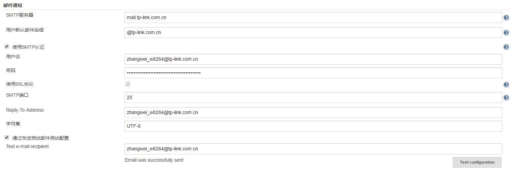

## jenkins邮件通知设定

email是Jenkins最基本的通知技术，在一个构建失败之后，他将给提交代码变更的开发人员以及可选的其他团队成员发送邮件。

Jenkins需要有一个能够发送邮件的账户，最好是系统管理员的email。

Jenkins本身就带有Email的功能，打开“系统设置”即可找到，配置具体情况如下：

* SMTP服务器填写需要有完整的域名，如果是本机的邮件服务器，则可以填写Localhost
* 默认的后缀缺省是SMTP服务器的域，如果是本地的邮件服务器的话，则需要填写完整的后缀
* 如果是需要认证的邮箱，则勾选SMTP认证
* 填写用户名和密码，如果之前填写了默认后缀，那么可以省略掉后缀
* 关于SSL协议，由于使用SSL协议之后会出现端口号的变更，因此如果勾选则要一并更改后面的端口号
* 端口号填写SMTP的端口号25，如果选择了SSL，则需要填写非标准端口465
* Reply-To Address是很重要的参数，每次构建出现unstable状态的时候，jenkins会主动通知这个参数中地址
* 字符集选择通用字符集UTF-8即可
* 最后可以通过一个测试邮件来验证邮箱的配置是否生效

